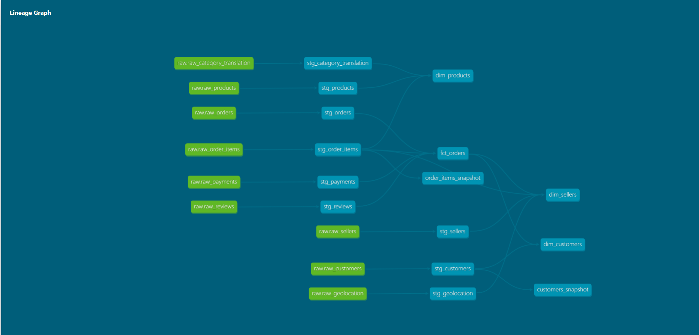

# 🛒 E-Commerce Data Pipeline

> A production-grade end-to-end ELT pipeline built on Brazilian e-commerce data (Olist dataset, ~100k orders), showcasing modern data engineering best practices across ingestion, transformation, orchestration, and visualization.



---

## 📋 Table of Contents

- [Overview](#overview)
- [Architecture](#architecture)
- [Tech Stack](#tech-stack)
- [Project Structure](#project-structure)
- [Pipeline Layers](#pipeline-layers)
- [Data Quality](#data-quality)
- [Orchestration](#orchestration)
- [Security](#security)
- [Dashboard](#dashboard)
- [Setup & Installation](#setup--installation)
- [What I'd Add in Production](#what-id-add-in-production)

---

## Overview

This project implements a fully automated ELT pipeline for Brazilian e-commerce data. Raw CSV data is ingested into Snowflake, transformed through staging and mart layers using dbt, orchestrated by Apache Airflow running in Docker, and visualized in Power BI.

**Dataset:** [Olist Brazilian E-Commerce](https://www.kaggle.com/datasets/olistbr/brazilian-ecommerce) — 9 CSV files, ~100k orders, 2016-2018

**Key highlights:**
- Bulk loading via Snowflake internal stages and COPY INTO
- Medallion architecture with RAW → STAGING → MARTS schema separation
- 53 automated data quality tests covering uniqueness, nullability, referential integrity and accepted values
- SCD Type 2 historical tracking using dbt snapshots
- Dockerized Airflow DAG with Slack alerting on failures
- Production-grade RBAC following least privilege principles

---

## Architecture

```
┌─────────────────────────────────────────────────────────────────┐
│                        DATA SOURCES                             │
│              9 CSV Files (Olist Kaggle Dataset)                 │
└─────────────────────────┬───────────────────────────────────────┘
                          │
                          ▼
┌─────────────────────────────────────────────────────────────────┐
│                     INGESTION LAYER                             │
│         Python + Snowflake Internal Stage (PUT + COPY INTO)     │
└─────────────────────────┬───────────────────────────────────────┘
                          │
                          ▼
┌─────────────────────────────────────────────────────────────────┐
│                   SNOWFLAKE DATA WAREHOUSE                      │
│                                                                 │
│  ┌─────────────┐   ┌─────────────┐   ┌─────────────────────┐   │
│  │  RAW Schema │ → │  STAGING    │ → │    MARTS Schema     │   │
│  │             │   │  Schema     │   │                     │   │
│  │ Transient   │   │ 9 Views     │   │ fct_orders          │   │
│  │ Tables      │   │ 53 Tests    │   │ dim_customers        │   │
│  │             │   │             │   │ dim_products         │   │
│  └─────────────┘   └─────────────┘   │ dim_sellers         │   │
│                                      └─────────────────────┘   │
│                    ┌─────────────┐                              │
│                    │  SNAPSHOTS  │                              │
│                    │  SCD Type 2 │                              │
│                    └─────────────┘                              │
└─────────────────────────┬───────────────────────────────────────┘
                          │
                          ▼
┌─────────────────────────────────────────────────────────────────┐
│                    ORCHESTRATION                                 │
│              Apache Airflow (Docker Compose)                    │
│                                                                 │
│  ingest → snapshot → stg_run → stg_test → mart_run → mart_test  │
└─────────────────────────┬───────────────────────────────────────┘
                          │
                          ▼
┌─────────────────────────────────────────────────────────────────┐
│                    VISUALIZATION                                 │
│                   Power BI Dashboard                            │
└─────────────────────────────────────────────────────────────────┘
```

---

## Tech Stack

| Layer | Technology | Purpose |
|---|---|---|
| Ingestion | Python + Snowflake Connector | Bulk load CSVs via internal stage |
| Data Warehouse | Snowflake | Cloud data warehouse |
| Transformation | dbt (dbt-snowflake) | SQL transformations + testing |
| Orchestration | Apache Airflow 2.8.1 | Pipeline scheduling + monitoring |
| Containerization | Docker + Docker Compose | Airflow environment |
| Alerting | Slack Webhooks | Failure notifications |
| Visualization | Power BI | Business intelligence dashboard |
| Version Control | Git + GitHub | Source control |

---

## Project Structure

```
ecommerce-pipeline/
├── ingestion/
│   └── ingest.py                    # Python ingestion script
├── ecommerce_pipeline/              # dbt project
│   ├── models/
│   │   ├── staging/
│   │   │   ├── _sources.yml         # Source definitions
│   │   │   ├── _stg_models.yml      # Tests + documentation
│   │   │   ├── stg_orders.sql
│   │   │   ├── stg_customers.sql
│   │   │   ├── stg_order_items.sql
│   │   │   ├── stg_payments.sql
│   │   │   ├── stg_reviews.sql
│   │   │   ├── stg_products.sql
│   │   │   ├── stg_sellers.sql
│   │   │   ├── stg_geolocation.sql
│   │   │   └── stg_category_translation.sql
│   │   └── marts/
│   │       ├── fct_orders.sql
│   │       ├── dim_customers.sql
│   │       ├── dim_products.sql
│   │       └── dim_sellers.sql
│   ├── snapshots/
│   │   ├── customers_snapshot.sql   # SCD Type 2 - customer history
│   │   └── order_items_snapshot.sql # SCD Type 2 - price history
│   ├── macros/
│   │   └── generate_schema_name.sql # Custom schema routing
│   └── dbt_project.yml
├── orchestration/
│   ├── dags/
│   │   └── ecommerce_pipeline.py    # Airflow DAG
│   ├── Dockerfile                   # Custom Airflow image with dbt
│   ├── docker-compose.yaml
│   └── .env                         # AIRFLOW_UID, SLACK_WEBHOOK_URL
└── .gitignore
```

---

## Pipeline Layers

### 1. Ingestion (Python + Snowflake)

Raw CSV files are bulk loaded into Snowflake using a staged loading pattern:

```python
# Upload to internal stage
cursor.execute(f"PUT file://{filepath} @{stage_name} AUTO_COMPRESS=TRUE")

# Bulk load into transient table
cursor.execute(f"""
    COPY INTO {table_name}
    FROM @{stage_name}/{filename}.gz
    FILE_FORMAT = (TYPE=CSV SKIP_HEADER=1 NULL_IF=('', 'NULL'))
""")

# Clean up stage
cursor.execute(f"REMOVE @{stage_name}/{filename}.gz")
```

**Why transient tables in RAW?** No fail-safe storage needed since data is reloaded every run — saves Snowflake storage costs.

---

### 2. Staging Layer (dbt Views)

9 staging models clean and standardize raw data:

- Type casting all columns (VARCHAR → proper types)
- Renaming columns for consistency
- No business logic — clean and standardize only

```sql
-- Example: stg_orders.sql
SELECT 
    order_id,
    customer_id,
    order_status,
    order_purchase_timestamp::TIMESTAMP_NTZ as purchase_date,
    order_delivered_customer_date::TIMESTAMP_NTZ as delivered_customer_date,
    order_estimated_delivery_date::TIMESTAMP_NTZ as estimated_delivery_date
FROM {{ source('raw', 'raw_orders') }}
```

---

### 3. Marts Layer (dbt Tables)

Business-ready fact and dimension tables following Kimball methodology:

**fct_orders** — grain: one row per order
- Aggregated payment values, item counts, review scores
- Delivery time calculations
- Joins staging models via CTEs

**dim_customers** — customer attributes + lifetime metrics
- First/last purchase dates
- Lifetime value, total orders, avg order value
- Customer lifespan in days

**dim_products** — product catalog with performance metrics
- Category translation (Portuguese → English)
- Avg price, freight value, total units sold

**dim_sellers** — seller profile with performance metrics
- Location with lat/long coordinates
- Total orders, revenue, avg review score

---

### 4. SCD Type 2 Snapshots

Historical change tracking using dbt snapshots:

```sql

{{
    config(
        target_schema='snapshots',
        unique_key='customer_id',
        strategy='check',
        check_cols=['city', 'state', 'customer_zip_code_prefix']
    )
}}
SELECT * FROM {{ ref('stg_customers') }}

```

Each snapshot automatically adds:
- `DBT_VALID_FROM` — when this version became active
- `DBT_VALID_TO` — when this version expired (NULL = current)
- `DBT_SCD_ID` — unique row identifier

---

## Data Quality

**53 automated tests** across staging and mart layers:

| Test Type | Coverage |
|---|---|
| `unique` | All primary keys |
| `not_null` | All required columns |
| `accepted_values` | order_status, review_score, payment_type |
| `relationships` | 6 foreign key relationships |
| Composite unique | order_items (order_id + item_id), payments (order_id + sequential) |

Tests run as separate Airflow tasks — marts never build if staging tests fail.

---

## Orchestration

**Airflow DAG** (`schedule: daily at midnight`):

```
ingest_data 
    → dbt_snapshot 
        → dbt_run_staging 
            → dbt_test_staging 
                → dbt_run_marts 
                    → dbt_test_marts
```

**Task failure behavior:** If any task fails, all downstream tasks are skipped. Slack alert sent immediately.

**Custom Docker image** with dbt pre-installed:
```dockerfile
FROM apache/airflow:2.8.1-python3.10
RUN pip install dbt-snowflake==1.11.2 snowflake-connector-python pandas python-dotenv
```

**Slack alerting:**
```python
def slack_failure_alert(context):
    # Sends DAG id, task id, execution time and log URL to Slack
```

---

## Security

Production-grade RBAC following least privilege principles:

```sql
-- Dedicated role with minimum required permissions
CREATE ROLE ECOMMERCE_ENGINEER;

-- Future grants ensure new objects automatically inherit permissions
GRANT SELECT ON FUTURE TABLES IN SCHEMA ECOMMERCE_DB.RAW TO ROLE ECOMMERCE_ENGINEER;
GRANT SELECT ON FUTURE VIEWS IN SCHEMA ECOMMERCE_DB.STAGING TO ROLE ECOMMERCE_ENGINEER;

-- Service account - never use personal credentials in pipelines
CREATE USER ECOMMERCE_SVC_USER DEFAULT_ROLE = ECOMMERCE_ENGINEER;
```

**Additional security measures:**
- Credentials stored in `.env` files (gitignored)
- Slack webhook URL passed via Docker environment variables
- Service account rotated after accidental exposure during development
- `.gitignore` configured before first commit

---

## Dashboard

Power BI dashboard connected to Snowflake MARTS schema:


**Visuals:**
- Total Revenue: **16.01M BRL**
- Total Orders: **99.4K**
- Average Review Score: **4.09/5**
- Average Delivery Days: **12.5 days**
- Monthly Revenue Trend (line chart)
- Top 10 Customers by Lifetime Value
- Top 10 Sellers by Revenue
- Order Status Breakdown (97% delivered)

---

## Setup & Installation

### Prerequisites
- Python 3.10+
- Snowflake account
- Docker Desktop
- dbt-snowflake

### 1. Clone the repository
```bash
git clone https://github.com/bluryface208-cmyk/ecommerce-pipeline.git
cd ecommerce-pipeline
```

### 2. Set up environment variables
```bash
cp .env.example .env
# Fill in your Snowflake credentials
```

### 3. Set up Snowflake
```sql
-- Run the RBAC setup scripts
CREATE ROLE ECOMMERCE_ENGINEER;
CREATE DATABASE ECOMMERCE_DB;
CREATE SCHEMA ECOMMERCE_DB.RAW;
CREATE SCHEMA ECOMMERCE_DB.STAGING;
CREATE SCHEMA ECOMMERCE_DB.MARTS;
CREATE SCHEMA ECOMMERCE_DB.SNAPSHOTS;
```

### 4. Run ingestion
```bash
cd ingestion
python ingest.py
```

### 5. Run dbt transformations
```bash
cd ecommerce_pipeline
dbt deps
dbt run
dbt test
dbt snapshot
```

### 6. Start Airflow
```bash
cd orchestration
docker compose up airflow-init
docker compose up -d
# Visit http://localhost:8080 (user: airflow, pass: airflow)
```

---

## What I'd Add in Production

| Enhancement | Description |
|---|---|
| **AWS S3 External Stage** | Replace local CSV ingestion with S3 drop zone + Snowflake storage integration |
| **AWS MWAA** | Replace Docker Compose with managed Airflow on AWS |
| **Incremental Models** | Replace full refresh with incremental dbt models for large tables |
| **AWS Secrets Manager** | Replace .env files with proper secret management |
| **dbt Exposures** | Document Power BI dashboard as a dbt exposure for full lineage |
| **Snowflake Cortex** | Add AI sentiment analysis on customer reviews |
| **Great Expectations** | Add schema validation layer before ingestion |

---

## Author

Built as a portfolio project demonstrating production-grade data engineering patterns.

- **GitHub:** [bluryface208-cmyk](https://github.com/bluryface208-cmyk)
- **Dataset:** [Olist Brazilian E-Commerce on Kaggle](https://www.kaggle.com/datasets/olistbr/brazilian-ecommerce)